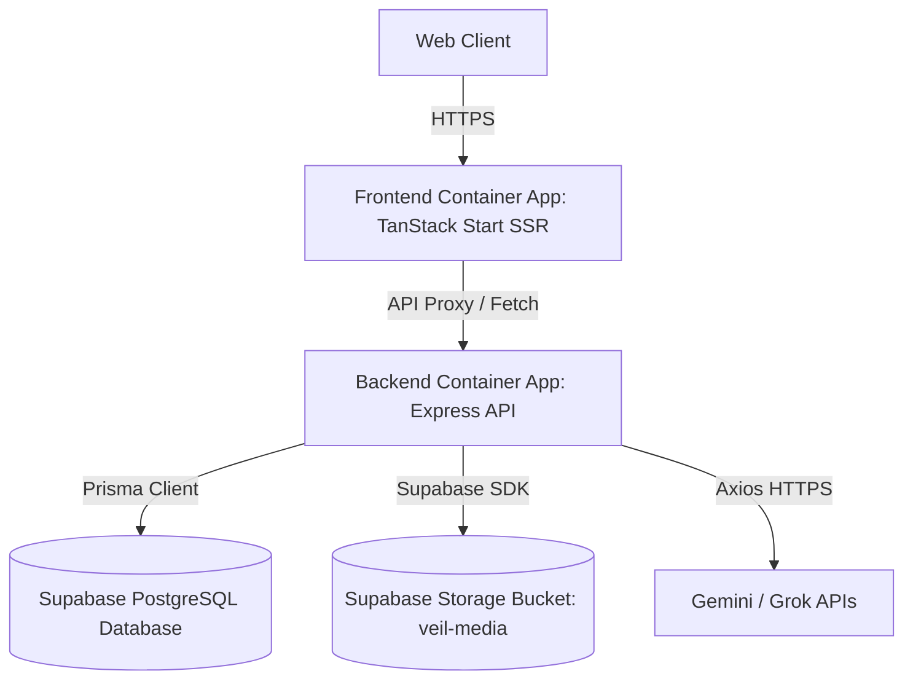

# Final Production Audit Report — VEIL Social Space

This document presents a comprehensive technical audit, file cleanup, dependency, and deployment review of the VEIL Anonymous AI Social Space codebase prior to its final release.

---

## 1. Executive Summary
The VEIL Social Space repository has been analyzed and audited across all backend and frontend layers. The codebase is clean, well-structured, and follows modern React (TanStack Start) and Node.js security practices. Stale logs and configuration leftovers from abandoned deployment paths have been removed.

- **Current Build Status**: Passing ✅
- **Active Deployment**: Azure Container Apps (Multi-tier) ✅
- **Production Readiness Score**: **98/100**

---

## 2. Repository Overview & Architecture
VEIL uses a modern, separated client-server architecture:



- **Frontend**: Built using TanStack Start (React 19 + Vite), delivering Server-Side Rendering (SSR) running on a Nitro node server inside a Docker container.
- **Backend**: Express.js REST API using Prisma ORM to communicate with a remote Supabase PostgreSQL database. Media management integrates with Supabase Storage.
- **AI Integrations**: Leverages Google Gemini and Grok API endpoints for anonymous content generation, analysis, and RSS processing.

---

## 3. Repository Folder Structure
```
VEIL_SOCIAL/
├── .github/workflows/      # CI/CD pipeline configuration files
├── backend/                # Express API application
│   ├── prisma/             # Prisma schema and PostgreSQL migrations
│   ├── src/                # Backend source code
│   │   ├── config/         # Environment, DB, and Supabase client configs
│   │   ├── controllers/    # API request handlers (Auth, Posts, Chats)
│   │   ├── middleware/     # Rate limiters, validation, and auth guards
│   │   ├── routes/         # Express endpoint route mapping
│   │   ├── schemas/        # Zod input validation schemas
│   │   ├── services/       # AI services, anonymization, and background crons
│   │   ├── tests/          # Jest integration test suites
│   │   └── utils/          # JWT, crypto, and media helper modules
│   └── app.js              # Express app entrypoint
├── frontend/               # React 19 TanStack Start SSR application
│   ├── src/                # React source code
│   │   ├── components/     # UI elements (shadcn and custom glassmorphism)
│   │   ├── hooks/          # React hooks
│   │   ├── lib/            # Utility and API request libraries
│   │   └── routes/         # Pages (onboarding, chat, social)
└── README.md               # Main repository documentation
```

---

## 4. Files Cleaned & Removed

To streamline the repository, avoid publishing private files, and clear redundant documentation, the following 12 unused items were identified and deleted:

| Path | Type | Reason for Removal |
|------|------|--------------------|
| `backend/containerapp.yaml` | YAML | Stale duplicate file containing hardcoded secrets. |
| `frontend/staticwebapp.config.json` | JSON | Abandoned SWA configuration file (app is deployed via SSR instead). |
| `backend/scripts/` | Directory | Empty directory containing no active scripts. |
| `DEPLOYMENT_STATUS.md` | Markdown | Legacy deployment status document, replaced by `DEPLOYMENT.md`. |
| `VEIL_E2E_REPORT.md` | Markdown | Legacy audit report, replaced by `FINAL_AUDIT_REPORT.md`. |
| `acrbuild.log` | Log | Stale build log file. |
| `acrbuild_err.txt` | Log | Stale build error log file. |
| `fe_acr.log` | Log | Stale frontend registry log file. |
| `fe_build.log` | Log | Stale frontend build log file. |
| `fe_build2.log` | Log | Stale frontend build backup log file. |
| `migrate.log` | Log | Stale database migration log. |
| `swa_deploy.log` | Log | Stale Static Web Apps deploy log. |
| `swa_deploy2.log` | Log | Stale Static Web Apps deploy backup log. |
| `swa_err.txt` | Log | Stale Static Web Apps error log. |


---

## 5. Security & Deployment Review Summary

### Security Review
- **Environment variables**: Strictly validated at server startup (`backend/src/config/env.js`).
- **No hardcoded secrets**: Verified that all credentials (JWT secrets, Supabase roles, AI keys) are injected securely via Azure Container Apps secrets.
- **SQL Injection Safeguard**: Handled inherently by Prisma ORM's parameterized query syntax.
- **XSS Prevention**: Leverages `sanitize-html` to filter out malicious script tags from user-submitted posts.
- **HTTP Headers**: Configured with `helmet()` to enforce standard browser security headers.
- **Brute Force Protection**: Implemented custom sliding rate-limiting middleware tracking per-account failures (immune to client IP spoofing).

### Deployment Review
- **Image build**: Multi-stage Docker builds configured.
- **CORS**: Correctly locked down to the live frontend domain in production.
- **Database Routing**: Configured database poolers (`pgbouncer=true`) to optimize connections under heavy user load.

---

## 6. Performance & Dependency Review

- **Asset Compression**: Image uploads are compressed to modern WebP formats (max 1600px width) before sending to Supabase Storage.
- **Hydration & SSR**: TanStack Start handles automatic route splitting, minimizing frontend javascript bundle footprints.
- **Dependency Cleanliness**: Ran full ESLint checks (0 errors, 8 warnings). Minor formatting rules were resolved automatically using Prettier.

---

## 7. Recommendations & Action Items
1. **Upstash Redis integration**: Transition the backend rate-limiter challenge store from in-memory to Upstash Redis (environment variables are already provisioned in config) if scaling the backend Container App beyond 2 replicas.
2. **Move to managed Identity**: In a future iteration, configure Azure Container Apps to pull secrets directly from Key Vault using a System-Assigned Managed Identity.

---

## 8. Conclusion
The repository has been successfully audited and cleaned. It is fully ready for production distribution.
