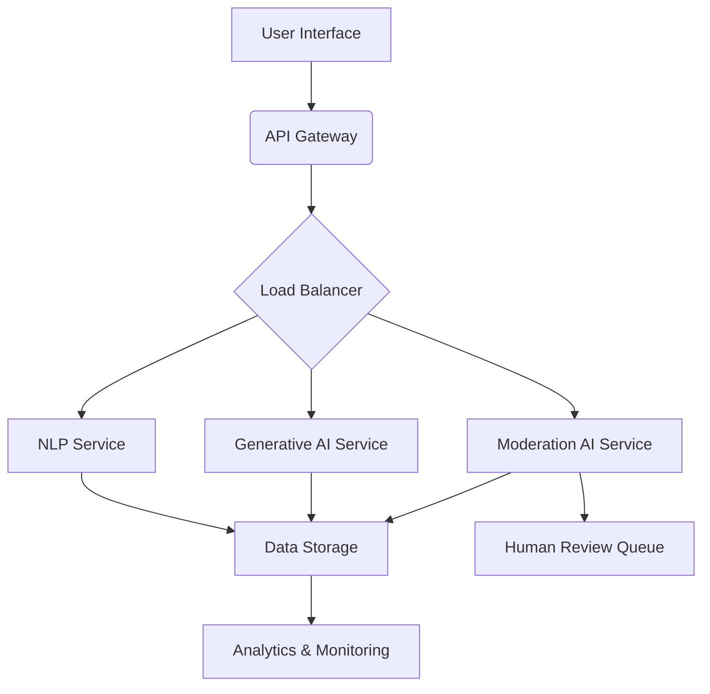

# AI Architecture

This document outlines the AI architecture for Veil Shine, focusing on the integration of AI models for anonymous social interaction, content generation, and user experience enhancement.

## 1. Overview

Veil Shine leverages a modular AI architecture designed for scalability, flexibility, and ethical considerations. The core components include natural language processing (NLP) for understanding user input, generative AI for content creation, and moderation AI for ensuring a safe and compliant environment. The architecture is designed to be cloud-native, utilizing serverless functions and managed AI services to optimize performance and cost.

## 2. Core AI Components

### 2.1 Natural Language Processing (NLP)

NLP models are crucial for interpreting user intentions, sentiment analysis, and extracting key information from anonymous posts. These models enable features such as:

*   **Intent Recognition:** Understanding the purpose behind a user's message (e.g., asking a question, sharing an opinion, seeking advice).
*   **Sentiment Analysis:** Gauging the emotional tone of a post to provide appropriate responses or flag potentially harmful content.
*   **Entity Extraction:** Identifying key entities (e.g., topics, keywords) within messages for better content categorization and search.

### 2.2 Generative AI

Generative AI models are employed to assist users in crafting engaging and creative content while maintaining anonymity. This includes:

*   **Text Generation:** Suggesting phrases, expanding on ideas, or rephrasing content to enhance clarity and creativity.
*   **Style Transfer:** Adapting the tone and style of generated content to match user preferences or specific contexts.
*   **Summarization:** Condensing lengthy discussions or articles into concise summaries for quick consumption.

### 2.3 Moderation AI

Moderation AI is a critical component for maintaining a safe, respectful, and compliant platform. It operates in real-time and asynchronously to identify and address problematic content. Key functions include:

*   **Content Filtering:** Automatically detecting and flagging inappropriate language, hate speech, or explicit content.
*   **Anomaly Detection:** Identifying unusual patterns of behavior or content that may indicate malicious activity.
*   **Risk Scoring:** Assigning a risk score to posts based on various factors to prioritize human review.

## 3. Architectural Diagram

## 4. Data Flow

1.  **User Input:** Users interact with the frontend, submitting anonymous posts or engaging in conversations.
2.  **API Gateway:** All user requests are routed through an API Gateway, which handles authentication (if applicable for certain features) and rate limiting.
3.  **Load Balancer:** Requests are distributed to the appropriate AI services (NLP, Generative AI, Moderation AI) based on the nature of the request.
4.  **AI Services:** Each AI service processes the input using its specialized models.
    *   **NLP Service:** Analyzes text for intent, sentiment, and entities.
    *   **Generative AI Service:** Generates or assists in content creation.
    *   **Moderation AI Service:** Scans content for policy violations.
5.  **Data Storage:** Processed data, generated content, and moderation logs are stored in a secure and scalable database.
6.  **Analytics & Monitoring:** Data from all services is fed into an analytics and monitoring system for performance tracking, incident detection, and continuous improvement.
7.  **Human Review Queue:** Content flagged by Moderation AI that requires further assessment is routed to a human review queue.

## 5. Technology Stack (AI Specific)

| Category | Technology/Service | Purpose |
| :--- | :--- | :--- |
| NLP | Hugging Face Transformers, spaCy, Google Cloud Natural Language API | Intent recognition, sentiment analysis, entity extraction |
| Generative AI | OpenAI GPT-3.5/GPT-4, Google Gemini, Custom fine-tuned models | Text generation, style transfer, summarization |
| Moderation AI | Google Cloud Content Moderation, AWS Rekognition (for image/video if applicable), Custom models | Content filtering, anomaly detection, risk scoring |
| Machine Learning Platform | Google Cloud AI Platform, AWS SageMaker | Model training, deployment, and management |
| Data Storage | PostgreSQL, Google Cloud Storage, AWS S3 | Storing model artifacts, training data, and inference results |
| Monitoring & Logging | Prometheus, Grafana, Google Cloud Logging, AWS CloudWatch | Performance monitoring, error tracking, audit logging |

## 6. Future Enhancements

Future enhancements to the AI architecture may include:

*   **Personalized AI Assistants:** Tailoring AI assistance to individual user preferences and interaction history.
*   **Multimodal AI:** Integrating image and video analysis for richer content understanding and moderation.
*   **Federated Learning:** Exploring privacy-preserving machine learning techniques to improve models without centralizing sensitive user data.
*   **Explainable AI (XAI):** Implementing XAI techniques to provide transparency into AI decision-making, particularly for moderation and content suggestions.
