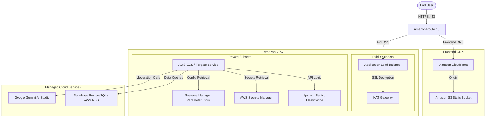

# AWS PRODUCTION ARCHITECTURE PLAN — VEIL

This document outlines the recommended AWS hosting architecture for the VEIL Anonymous Social Space production deployment. The architecture balances performance, scale, high availability, and strict privacy-focused security compliance.

## High-Level Topology Diagram

---

## Service Inventory & Rationale

### 1. Networking & DNS
*   **Amazon VPC**: Houses our API tasks in isolated private subnets, keeping them out of direct contact with the public internet.
*   **Amazon Route 53**: Secure latency-based DNS routing with failover support.
*   **AWS Certificate Manager (ACM)**: Issues and automatically renews SSL/TLS certificates for `veil.social` and `api.veil.social`.
*   **Application Load Balancer (ALB)**: Listens on port 443, handles SSL termination, and routes requests to active ECS target groups based on `/v1/*` paths.

### 2. Frontend Layer
*   **Amazon S3**: Hosts frontend static files (HTML, CSS, JS, font assets).
*   **Amazon CloudFront**: Caches static assets globally at Edge locations, lowering load latency and saving S3 egress fees.

### 3. Backend Compute Layer
*   **AWS ECS with Fargate**: Launches the Express API container serverlessly. Fargate eliminates EC2 virtual machine upkeep, handles OS security patches, and autoscales tasks based on CPU/Memory load.

### 4. Database & Cache
*   **PostgreSQL (Supabase / AWS RDS)**: Stores relation schemas. Supabase is currently connected via pooler endpoints.
*   **Upstash Redis (or ElastiCache for Redis)**: Handles session challenges and API rate limiter registries in production.

### 5. Configs & Secrets
*   **AWS Secrets Manager**: Vaults variables (`JWT_SECRET`, `ENCRYPTION_KEY`, database connection strings) using KMS envelope encryption.
*   **AWS Systems Manager Parameter Store**: Stores non-secret strings (such as `WEBAUTHN_RP_NAME` and `PORT`).
