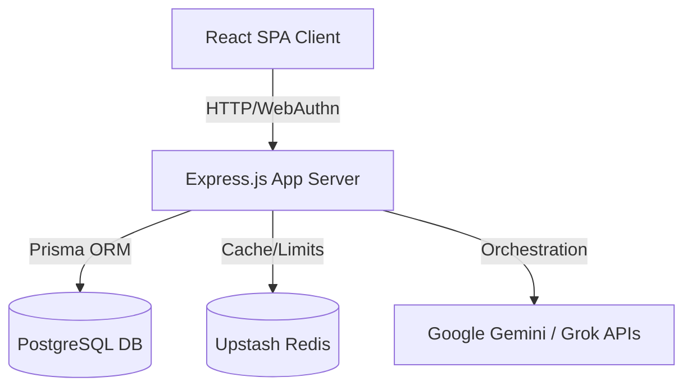
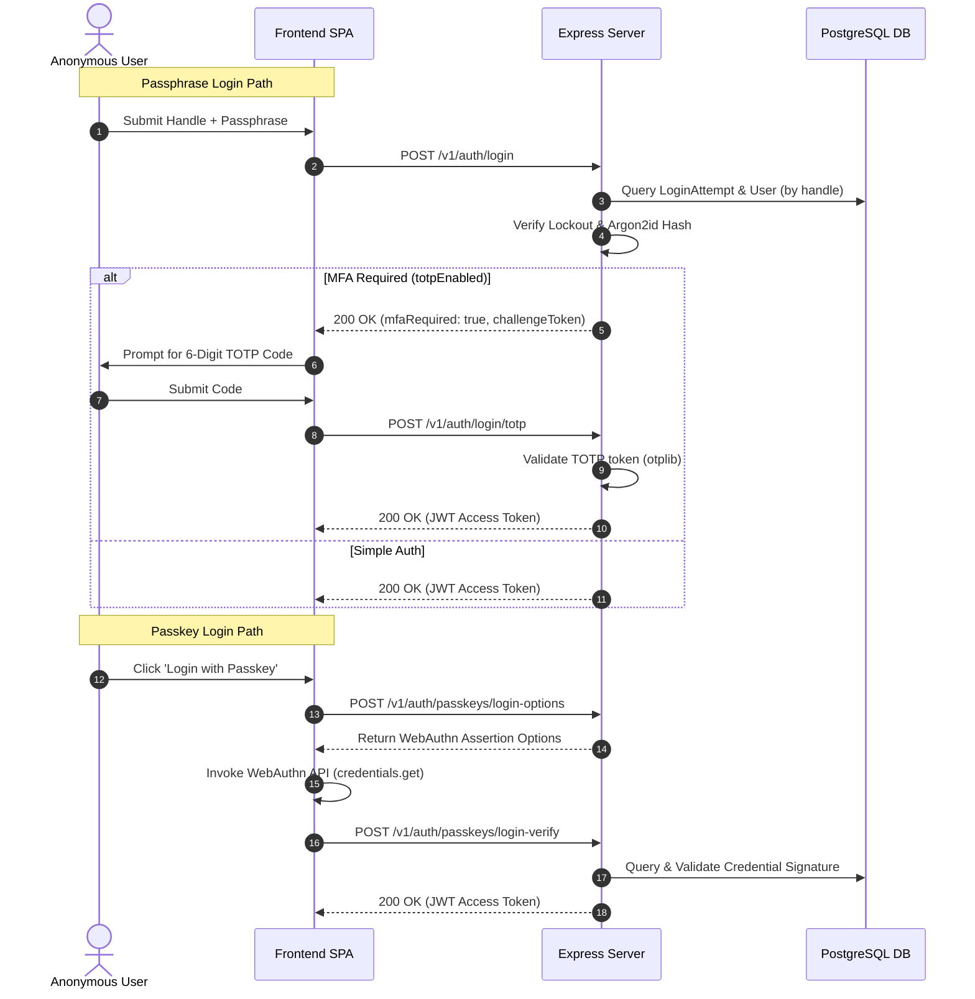
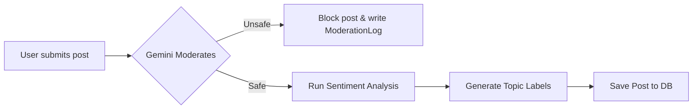

# Current Architecture Snapshot — VEIL

This document details the active technical architecture of VEIL as built today, detailing the service stack, database entities, authentication request paths, and media upload flows.

---

## 1. System Technology Stack



*   **Frontend**: React Single Page Application (SPA) built using Vite, styled with TailwindCSS and animated using Framer Motion. Uses TanStack Router for type-safe routing and TanStack Query (React Query) for state fetching and caching.
*   **Backend**: Node.js web server built with Express.js using ES Modules (`import/export`). Serves a REST API on port 3000.
*   **Database & ORM**: PostgreSQL database (deployed on Supabase) accessed via Prisma ORM client. Local development falls back to SQLite (`dev.db`).
*   **Cache & Rate Limiting**: Upstash Redis REST API client ( dually fallback-capable to in-memory store in local dev).
*   **AI Integrations**: Gemini (API compat) + Grok/Groq (LLM orchestration) for article generation, text corrections, and moderation checks.

---

## 2. Authentication Flow

VEIL utilizes a hybrid model: passphrase-based logins act as the primary registration step, recovery codes serve as the fallback rescue option, and WebAuthn Passkeys offer a discoverable passwordless login.

### Registration Flow
1.  User enters a handle. The server checks for uniqueness in PostgreSQL.
2.  User submits a passphrase. The client measures entropy ( Shannon bits).
3.  The backend verifies the passphrase against the HIBP database, hashes it using Argon2id, generates 8 BIP39 word lists, hashes them using HMAC-SHA256, and writes all records to PostgreSQL in a transaction.
4.  User is shown the recovery codes and optionally registers a WebAuthn Passkey credential.

### Authentication request flow (Passphrase, TOTP, and Passkey)



---

## 3. Media Upload Flow

Media uploads are constrained to image/video extensions and verified using a MIME type filter before storage.

```mermaid
sequenceDiagram
    autonumber
    actor User as Anonymous User
    participant Client as Frontend SPA
    participant Server as Express Server

    User->>Client: Select Media (Image/Video)
    Client->>Server: POST /api/upload (Multipart FormData)
    Note over Server: requireAuth Middleware runs
    alt Unauthenticated
        Server-->>Client: 401 Unauthorized
    else Authenticated
        Note over Server: Multer inspects MIME type & 15MB limit
        alt Disallowed MIME / Too Large
            Server-->>Client: 415 / 413 Error
        else Allowed
            Server->>Server: Read buffer & convert to base64
            Server-->>Client: 200 OK { url: "data:mime;base64,..." }
        end
    end
    Client->>Client: Embed base64 string as mediaUrl in Post body
    Client->>Server: POST /v1/posts { content, mediaUrl, mode }
```

---

## 4. AI Orchestration Architecture

Content creation and publishing trigger a content analysis cycle:



### Generator-Critique Orchestration
For AI-assisted article generation, the server coordinates a critique loop:
1.  **Generation Phase**: Grok writes a draft based on the user's prompt (using `llama-3.3-70b-versatile` or `grok-beta`).
2.  **Critique & Polish Phase**: The draft is passed to Gemini (`gemini-2.5-flash`) as context with instructions to edit, refine readability, and format in clean Markdown.
3.  **Local Fallback**: If either API key is missing or offline, the server falls back to direct single-LLM generation or returns a developer placeholder.
