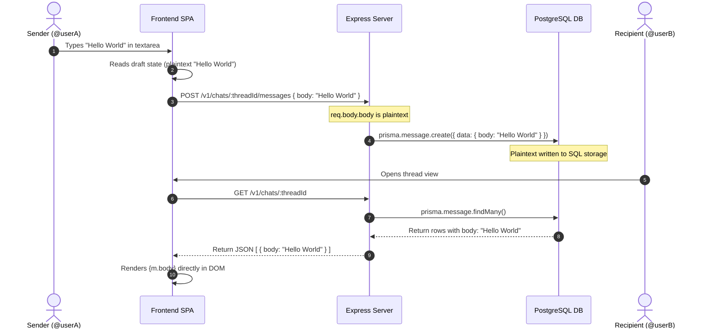

# End-to-End Encryption (E2EE) Verification Report — VEIL

*Date of Audit: July 8, 2026*  
*Target Commit: b5eb244 (or current head)*  

---

## 1. Verdict

> [!CAUTION]
> **VERDICT: VEIL messaging IS NOT end-to-end encrypted.**  
> There is **no cryptography** applied to chat messages at any stage of the lifecycle. Messages are transmitted, processed, stored, and retrieved in clear plaintext. The UI copy and HTML metadata claiming "End-to-end encrypted" and "Local Encryption" are entirely false representations of the current codebase.

---

## 2. E2EE Requirement Evaluation Table

| # | Requirement | Status | File & Line Evidence |
| :--- | :--- | :--- | :--- |
| **1** | User private key never leaves the client device. | ❌ **FAILED** | No client-side key generation or IndexedDB/local storage exists for message keys in `frontend/src/`. |
| **2** | User public key published via the server. | ❌ **FAILED** | No public key registry, endpoints, or Prisma columns exist for message keys in `schema.prisma`. |
| **3** | Client-side encryption before transmission. | ❌ **FAILED** | [api.ts:L293-L300](file:///e:/VEIL_SOCIAL/frontend/src/lib/api.ts#L293-L300) passes the raw textarea string directly as JSON. |
| **4** | Server only receives and stores ciphertext. | ❌ **FAILED** | [chats.controller.js:L258-L266](file:///e:/VEIL_SOCIAL/backend/src/controllers/chats.controller.js#L258-L266) inserts `req.body.body` directly to the `Message` table. |
| **5** | Client-side decryption only. | ❌ **FAILED** | [messages.$threadId.tsx:L342](file:///e:/VEIL_SOCIAL/frontend/src/routes/messages.$threadId.tsx#L342) renders `m.body` directly as a plaintext string in the DOM. |
| **6** | DB dump compromise protects message plaintext. | ❌ **FAILED** | Any database dump or unauthorized SQL read exposes all direct messages in clear, readable plaintext. |

---

## 3. Message Data Flow Trace

Tracing a message sent from `@userA` to `@userB`:



1.  **Draft Input**: The user types a message in the input text field. The `handleSend` routine in [messages.$threadId.tsx:L136-139](file:///e:/VEIL_SOCIAL/frontend/src/routes/messages.$threadId.tsx#L136-L139) immediately calls the mutation helper:
    ```typescript
    sendMessageMutation.mutate({ body: draft, mediaUrl: attachedMedia });
    ```
2.  **API Transport**: The mutation calls `sendChatMessage` in [api.ts:L293-L300](file:///e:/VEIL_SOCIAL/frontend/src/lib/api.ts#L293-L300), sending a standard JSON payload:
    ```typescript
    const res = await fetch(`${API_BASE}/v1/chats/${threadId}/messages`, {
      method: "POST",
      headers: getHeaders(),
      body: JSON.stringify({ body, mediaUrl }),
    });
    ```
3.  **Server Controller**: The Express backend parses the JSON. Inside [chats.controller.js:L258-L266](file:///e:/VEIL_SOCIAL/backend/src/controllers/chats.controller.js#L258-L266), the controller writes the unencrypted body parameter directly:
    ```javascript
    const message = await prisma.message.create({
      data: {
        threadId,
        senderId: req.user.id,
        body: body || "",
        mediaUrl: mediaUrl || null,
        expiresAt
      }
    });
    ```
4.  **Database Storage**: In PostgreSQL, the `body` field of the `Message` table stores `"Hello World"`.
5.  **Retrieval**: When fetching chat history, `getChatMessages` in [chats.controller.js:L108-114](file:///e:/VEIL_SOCIAL/backend/src/controllers/chats.controller.js#L108-L114) maps DB values directly to the HTTP response:
    ```javascript
    const formatted = messages.map((m) => ({
      id: m.id,
      body: m.body,
      mediaUrl: m.mediaUrl,
      mine: m.senderId === req.user.id,
      time: new Date(m.createdAt).toLocaleTimeString([], { hour: "2-digit", minute: "2-digit" })
    }));
    ```
6.  **Client Render**: The client renders `m.body` directly inside the DOM in [messages.$threadId.tsx:L342](file:///e:/VEIL_SOCIAL/frontend/src/routes/messages.$threadId.tsx#L342):
    ```typescript
    {m.body && <p className="break-words whitespace-pre-wrap">{m.body}</p>}
    ```

---

## 4. UI Misrepresentations and False Claims

The frontend contains multiple instances where users are falsely assured of message confidentiality:
1.  **Meta Header Info**: [messages.tsx:L16](file:///e:/VEIL_SOCIAL/frontend/src/routes/messages.tsx#L16) states:
    `"End-to-end encrypted 1:1 messaging. Sealed sender..."`
2.  **Encrypted Banner badge**: [messages.tsx:L84](file:///e:/VEIL_SOCIAL/frontend/src/routes/messages.tsx#L84) displays:
    `"End-to-end encrypted"`
3.  **Local Encryption Banner Info**: [messages.index.tsx:L38-40](file:///e:/VEIL_SOCIAL/frontend/src/routes/messages.index.tsx#L38-L40) states:
    `"Local Encryption: Messages are encrypted locally before leaving your device. Only the recipient can read them."`
4.  **Security Notice tag**: [messages.$threadId.tsx:L273](file:///e:/VEIL_SOCIAL/frontend/src/routes/messages.$threadId.tsx#L273) renders:
    `"Encrypted · auto-deleted after ..."`

---

## 5. Honest Classification

The current message privacy level is **Transport Encryption Only (HTTPS)**. 
*   Data is protected from eavesdroppers on the local Wi-Fi or internet backbone via standard TLS.
*   Once it hits the Express server gateway, it is decrypted and handled in plaintext memory.
*   It is written in plaintext to the database.

---

## 6. Minimal Remediation Path

To implement real E2EE with minimal codebase disruption, we recommend a client-side **asymmetric key-pair scheme** utilizing the browser's native **WebCrypto API** (supported in all target browsers).

### Step A: Database Schema Adjustments
Add public keys to the `User` model in `schema.prisma`:
```prisma
model User {
  id              String   @id @default(uuid())
  // ...
  chatPublicKey   String?  // Base64 WebCrypto SPKI public key representation
}
```

### Step B: Client-Side Key Generation (Onboarding)
Upon user registration or first login, generate an ECDH (Elliptic Curve Diffie-Hellman) key pair. Store the private key in the browser's `IndexedDB` (non-extractable) and upload the public key:
```javascript
// Generate keypair
const keyPair = await window.crypto.subtle.generateKey(
  { name: "ECDH", namedCurve: "P-256" },
  false, // Private key cannot be exported/read by external scripts
  ["deriveKey", "deriveBits"]
);

// Export public key to send to server
const pubKeyExport = await window.crypto.subtle.exportKey("spki", keyPair.publicKey);
const pubKeyBase64 = btoa(String.fromCharCode(...new Uint8Array(pubKeyExport)));

// Save private key in IndexedDB locally (un-exportable)
await savePrivateKeyToIndexedDB(keyPair.privateKey);

// Upload pubKeyBase64 to server via PATCH /v1/auth/chat-public-key
```

### Step C: Message Encryption on Send (Client-Side)
When user A messages user B:
1.  Fetch user B's `chatPublicKey` from the server.
2.  Import user B's public key and user A's private key.
3.  Perform ECDH key agreement to derive a shared symmetric AES-GCM key.
4.  Encrypt the message body using `AES-GCM` (256-bit).
5.  Send the base64-encoded ciphertext and the dynamic IV (initialization vector) to the server.

### Step D: Decryption on Receive (Client-Side)
When user B downloads the message feed:
1.  Import user A's public key and user B's private key.
2.  Derive the same shared symmetric key.
3.  Decrypt the ciphertext payload using the dynamic IV.
4.  Render the plaintext result in the DOM.

---

## 7. Action Items Summary

> [!WARNING]
> **IMMEDIATE COMPLIANCE REQUIREMENT**:
> If implementing the WebCrypto E2EE remediation path is deferred, the UI labels and HTML description tags in [messages.tsx](file:///e:/VEIL_SOCIAL/frontend/src/routes/messages.tsx), [messages.index.tsx](file:///e:/VEIL_SOCIAL/frontend/src/routes/messages.index.tsx), and [messages.$threadId.tsx](file:///e:/VEIL_SOCIAL/frontend/src/routes/messages.$threadId.tsx) **must be edited immediately** to remove all occurrences of "End-to-end encrypted", "locally encrypted", or "Encrypted". Leaving these claims in place constitutes false safety guarantees for vulnerable user segments.
